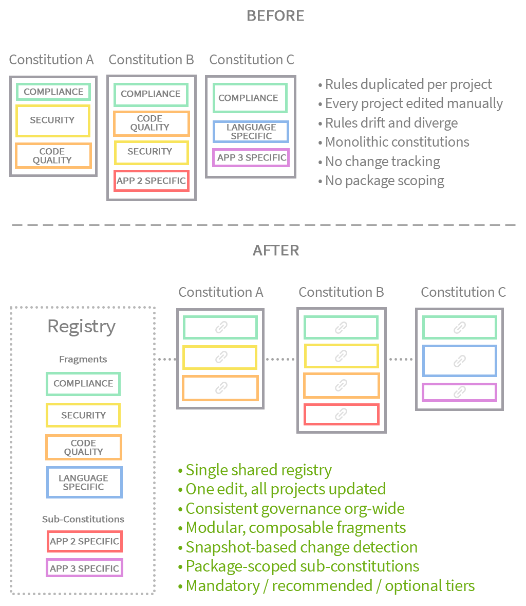

# Charter: Constitution Composer for Spec Kit

A [Spec Kit](https://github.com/github/spec-kit) extension that enables modular
composition of project constitutions from shared fragment registries.

## Problem

Organizations with multiple applications using Spec Kit often share common
governance rules (security policies, coding standards, domain regulations).
Without Charter, each project maintains its own constitution independently,
leading to:

- **Inconsistency** — shared rules diverge across projects
- **Maintenance burden** — updating a common rule requires editing every project
- **No modularity** — constitutions are monolithic, mixing shared and project-specific rules

## What Charter Does

Charter introduces a **registry-based composition model** for constitutions:

1. **Centralize shared rules** as reusable fragments in a registry (local directory or git repo)
2. **Select fragments** per project — mandatory, recommended, and optional
3. **Compose** a final constitution by assembling selected fragments + project-specific rules
4. **Track changes** — detect when fragments are modified locally vs. updated in the registry
5. **Support monorepos** — sub-constitutions scope rules to specific packages


<p align="center" style="margin-top: 30px">
  
</p>

## Installation

```bash
# From Spec Kit Catalog
specify extension add charter

# From GitHub release
specify extension add charter --from https://github.com/Fyloss/spec-kit-charter/archive/refs/tags/v0.3.1.zip
```

## Quick Start

### 1. Set Up a Registry

Create a fragment registry (local directory or git repo):

```
.charter/
├── manifest.yml
├── fragments/
│   ├── global/
│   │   ├── compliance.md
│   │   └── code-quality.md
│   └── languages/
│       └── typescript/
│           └── standards.md
└── sub-constitutions/
    ├── package-auth.md
    └── package-api.md
```

Create `manifest.yml`:

```yaml
version: 1
name: "My Organization Charter Registry"
mandatory_fragments:
  - "global/compliance"
recommended_fragments:
  - "global/code-quality"
```

### 2. Configure Charter

```
/speckit.charter.config
```

This command will:
- Ask for the registry location (defaults to `.charter` in the project root)
- Validate the registry structure
- List available fragments for selection
- Save your composition choices

### 3. Compose the Constitution

```
/speckit.charter.compose
```

This command will:
- Back up the existing constitution
- Assemble all selected fragments
- Invoke `/speckit.constitution` to generate the final file
- Validate the output

### Express Mode — Configure and Compose in One Step

You can skip step 2 entirely. If no configuration exists yet, running
`/speckit.charter.compose` directly will perform the configuration inline:

```
/speckit.charter.compose
```

The combined flow:

1. **Asks for the registry value** (proposing the current/default `.charter`) —
   first input
2. Shows the fragment list and asks for your **selection** — second input
3. Displays the composition summary (no confirmation prompt)
4. Proceeds automatically to generate the constitution

If the generated constitution is not valid, run `/speckit.charter.restore` to
restore the previous constitution.

Use this when you want to go from a fresh registry to a composed constitution
without switching commands.

## Commands

| Command | Description |
|---------|-------------|
| `/speckit.charter.config` | Configure registry and select fragments |
| `/speckit.charter.compose` | Compose constitution from selected fragments |
| `/speckit.charter.compose update` | Update all fragments from registry |
| `/speckit.charter.compose update <name>` | Update a single fragment |
| `/speckit.charter.add <name>` | Add a new fragment from the registry |
| `/speckit.charter.remove <name>` | Remove a fragment from the composition |
| `/speckit.charter.restore` | Restore constitution to last backup |

## Registry Structure

```
<registry_root>/
├── manifest.yml                    # Required: registry metadata
├── fragments/                      # Constitution fragments
│   ├── global/                     # Organization-wide rules
│   │   ├── compliance.md
│   │   └── security.md
│   ├── domains/                    # Domain-specific rules
│   │   ├── finance/
│   │   │   └── regulations.md
│   │   └── ecommerce/
│   │       └── checkout.md
│   └── languages/                  # Language/tech-specific rules
│       ├── typescript/
│       │   └── standards.md
│       └── python/
│           └── style.md
└── sub-constitutions/              # Monorepo package-specific rules
    ├── package-auth.md
    └── package-api.md
```

### Manifest Format

```yaml
version: 1
name: "Organization Charter Registry"
mandatory_fragments:
  - "global/compliance"             # Always included, cannot be deselected
recommended_fragments:
  - "global/code-quality"           # Pre-selected, can be deselected
```

## Constitution Output

The composed constitution uses HTML comment markers to delimit sections:

```markdown
<!-- [global/compliance] SECTION -->
<compliance fragment content>

<!-- [global/code-quality] SECTION -->
<code quality fragment content>

<!-- [package-auth] SECTION -->
WHEN WORKING ON package-auth, FOLLOW THESE INSTRUCTIONS:
<package-auth sub-constitution content>

<!-- [PROJECT SPECIFIC] SECTION -->
<existing project-specific constitution content>
```

These markers enable:
- Section-level update detection
- Individual fragment replacement
- Preservation of project-specific rules during recomposition

## Monorepo Support

Sub-constitutions in the registry's `sub-constitutions/` directory are designed
for monorepos. Each sub-constitution is scoped to a specific package with a
prefix line:

```markdown
WHEN WORKING ON <package-name>, FOLLOW THESE INSTRUCTIONS:
```

This allows the AI agent to apply package-specific rules only when working
within that package's context.

## Storage Locations

Charter stores all persistent data under `.specify/charter/` — a dedicated
directory that lives **outside** the extension install dir so it survives
`specify extension update`/`remove` and project re-inits. Commit it to git.

| Data | Location | Purpose |
|------|----------|---------|
| Config | `.specify/charter/config.yml` | Registry path and type |
| State | `.specify/charter/state.yml` | Selected fragments and local constitution |
| Snapshots | `.specify/charter/snapshots/` | Saved fragment versions for change detection |
| Backups | `.specify/charter/backups/` | Constitution backups before recomposition |
| Registry cache | `.specify/charter/.cache/registry/` | Cloned git registry (gitignored) |

## Documentation

- [Usage Guide](docs/usage.md) — detailed usage instructions
- [Registry Setup](docs/registry-setup.md) — how to create and maintain a registry
- [Commands Reference](docs/commands.md) — full command documentation
- [Architecture](docs/architecture.md) — design decisions and data flow

## Compatibility

- Spec Kit: >= 0.11.9
- Git: optional (required only for git-based registries)
- OS: Linux, macOS, Windows (via Git Bash / WSL)

## License

MIT — see [LICENSE](LICENSE)
